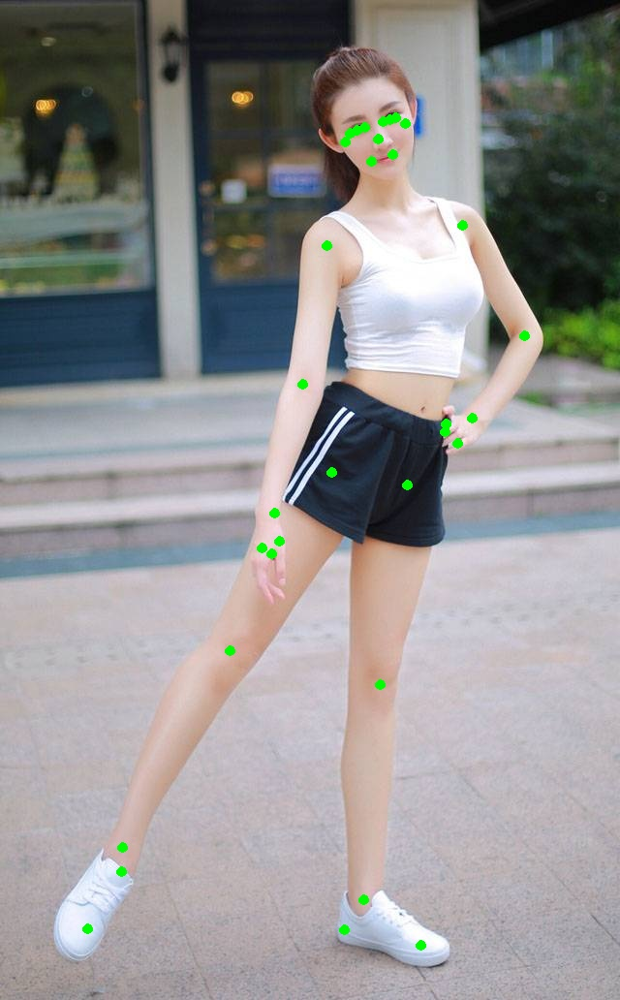

# A demo to detection the human pose 
implementation is referring to google mediapipe blaze pose. Thanks their good work.

# Installation
## conda
 if you base env is conda：
 ```
conda env create -f blazepose.yaml
conda activate blazepose
```
## pip env
```
pip install -r requarement.txt
```

(install other package as you need)
(if you want to run the mediapipe blaze pose api, you should install mediapipe:pip install mediapipe)

# Run demo
In the demo.py file , there are single image and wecam demo, you should config you data file and run the demo.


# Debug process

- single image demo[funcDemo](file:///demo.py):
    ```
    Code logic:
        1.Update the cfg file:update workspace root dir.
        |
        2.Initialize the detection model and pose model.
        |
        3.Human detection
        |
        4.Transform detection result to ROI 
        |
        5.Do pose estimation
        |
        6.The post process of normalized landmarks(refine)
        |
        7.Do projection of landmarks to original image scale
        |
        8.Get the ROI from pose result.(option,for tracking)
    ```

    - input: 
    
    
    - result:
    
    !
    
    
   - Detection:
        -  [ssd anchor generator](file:///pose_detection/anchor.py):Generate the SSD anchors, The generated file:[anchors](file:///mdoels/anchor_224x224.npy)
     
        -  The tflite model ouput: 
            - output_reg:[1,2254,12] ([reg](file:///results/detection_model_output_reg.npy))
            - ouput_cls:[1,2254] ([cls](file:///results/detection_model_output_cls.npy))
        -  [model(105)](file:///pose_detection/model.py): detction_model._rawOutput2Detection output:detections[list,length=1], [output data](file:///results/_rawOutput2Detection_output.npy)
        -  [model(161)](file:///pose_detection/model.py): detection_model._decode_box: [output_data](file:///results/decode_box_output.npy)
        -  [model(111)](file:///pose_detection/model.py): [NMS output](file:///results/nms_output.npy)
        -  detection model output normalized roi: (detection_model._getROI())
            - center_x: 0.626997709274292
            - center_y: 0.5052854418754578
            - width: 1.5138027105369294 
            - height: 0.938792378627553
            - rotation: 0.8602881017568764 (degree unit)
   - Landmarks:
        -  [TransformNormalizedRect](file:///utils/img_process_tools.py): 
            - center_x: 0.626997709274292
            - center_y: 0.5052854418754578
            - width: 1.5138027105369294
            - height: 0.938792378627553
            - rotation: 0.8602881017568764
        -  [ImageTransform](file:///utils/img_process_tools.py): 
            - warped image: 
            
            
            
        -  [Pose model](file:///pose_estimation/model.py): [output_coordinates:(1,195)](file:///results/pose_model_coordinates.npy)
        -  [Pose model](file:///pose_estimation/model.py): [output_heatmap:(1,64,64,39)](file:///results/pose_model_heatmap.npy)
        -  [Pose model](file:///pose_estimation/model.py): [refine_landmarks:(39,5)](file:///results/refine_landmarks.npy)
        -  [Pose model](file:///pose_estimation/model.py): [projected_landmarks:(39,5)](file:///results/projected_landmarks.npy)
            
        
